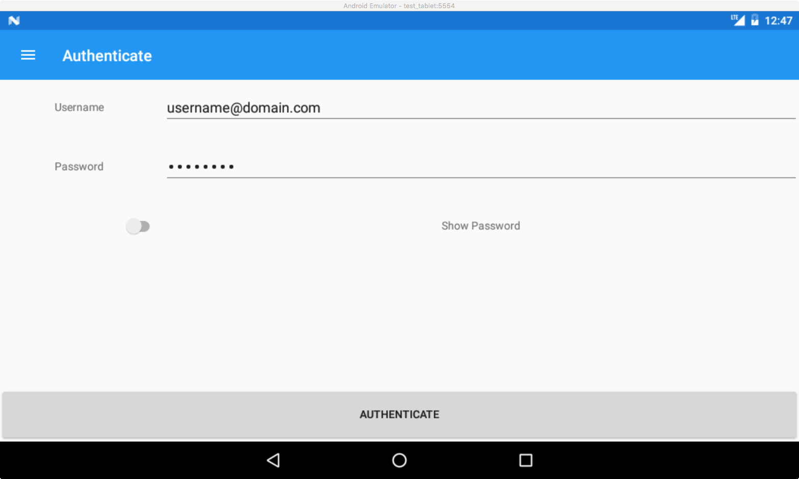

#  Mobile Direct Participant Monitoring System (mDPMS) User Guide

# 1. Introduction

This Mobile Direct Participant Monitoring System (mDPMS) User Guide (UG) provides an overview on how to effectively use the mDPMS mobile application.

# 2. Overview

The mDPMS application allows users to collect data on a wide variety of mobile devices even in remote areas where there is no access to the internet.  These data can be stored on the mobile device until the device can be connected to the internet and the data can be synchronized with the project's DPMS.

## 2.1 Conventions

This document provides screen prints and corresponding narrative to describe how to use the mDPMS application.  When a screen object is referenced, it is indicated with the following format ```Item Text```

**Note:** The term ‘user’ is used throughout this document to refer to a person who requires and/or has acquired access to the mDPMS application.

# 3. Getting Started

## 3.1 Set-up Considerations

* Users must have internet access for the following set-up steps in addition to access to their project's DPMS to synchronize the collected data.

* The mDPMS application is supported on Android devices running 4.0.3 up to the current release at the time of this documentation (8.1).  It will run on either a tablet or a smartphone; however, the tablet is the recommended device due to its larger navigational screen.

## 3.2 User Access Considerations

* Users must have access to their project's DPMS in order to use the mDPMS application.

## 3.3 Installation and Set Up

* Download from the Google Play Store https://play.google.com/store/apps/details?id=com.companyname.MDPMS
* Launch the app.
* Open the menu by selecting ```☰``` on the top left of the screen if is not already open


  
* Select ```SETTINGS``` from the menu
* Enter your DPMS URL in the text entry ```DPMS URL```


  
* Select the check to save the URL


  


* Select ```GET NEW API KEY```


  
* Enter your DPMS credentials


  

* Select ```AUTHENTICATE```


  
* If authentication was successful, the user will be sent back to the ```Settings``` screen and ```API Key``` will read ```Yes```.  If the user receives an error message, please check the following:
  * Ensure the internet access is operational
  * Use a web browser from the device to access the DPMS
    * Can you can reach your DPMS from the device?
    * Is your DPMS online and working properly?  If not please contact your administrator for assistance.
    * Are your credentials able to access your DPMS using the web browser?
  * Ensure login credentials were entered correctly.
    * You can select ```Show Password``` on the ```Authenticate``` screen to view and verify the password entered.
    * Note that some Android devices will have autocorrect features enabled by default so check that the username is correct as well.


  
* Select ```SYNC``` from the menu to perform an initial sync


  
  
* Once completed you will see a message that the sync was sucessful and you can now start using the app to collect data offline.


  

## 3.4 System Organization & Navigation

The data in the following hierarchy can be viewed and collected using mDPMS:

* Households

    * Income Sources

    * Household Members (People and Participants)

        * Follow Ups

        * Service Assignments

There are two main entry points on the menu for accessing data.  Each entry point provides access down the hierachy.

* ```HOUSEHOLDS```
  * This will allow access to any household in the DPMS at the time of last sync and locally entered
* ```PARTICIPANTS```
  * This will allow access to any participant in the DPMS at the time of last sync and locally entered
  * Participant is defined as a person between the ages of 5 and 17 at the date of viewing or at the date of intake

If the data has not been uploaded and synced to the project’s DPMS, it can be edited or deleted.  Items in a list having an ID number present have been synced and therefore cannot be edited or deleted. Items without a number when viewed will have an edit and delete button present. Users should note that when an item is deleted all objects beneath it in the hierarchy will also be deleted.

# 4. Using the System

## 4.1 Viewing and Collecting Data

### 4.1.1 Households Search View
This household search view allows users to:

* View and search all households in the DPMS at the time of last sync and locally entered

* Select a household to navigate to the household view

* View the number of households

* Add a household


  

### 4.1.2 Participants Search View
This participant search view allows users to:

* View and search all participants in the DPMS at the time of last sync and locally entered

* Select a participant to navigate to the person view

* View the number of participants


  

### 4.1.3 Household View
This household view allows users to:

* View the properties for a household intake

* Edit or delete the household if not synced

* View a list of the income sources for a household

    * Select an income source to navigate to the income source view

    * Add an income source

* View a list of the members of a household
  
    * Select a person to navigate to the person view
  
    * Add a person


  
  
  
  
  
  

### 4.1.4 Income Source View
This income source view allows users to:

* View the properties for an income source

* Edit or delete the income source if not synced


  
  
  
  

### 4.1.5 Person View
This person view allows users to:

* View the properties for a person

* Edit or delete the person if not synced

* View a list of the follow ups for a person

  * Select a follow up to navigate to the follow up view

  * Add a follow up to the person

* View a list of the service assignments for a person

  * Select a service assignment to navigate to the service assignment view

  * Add a service assignment to the person


  
  
  
  
  
  

### 4.1.6 Follow Up View
This follow-up view allows users to:

* View the properties for a follow up

* Edit or delete the follow up if not synced


  
  
  
  

### 4.1.7 Service Assignment View
This service assignment view allows users to:

* View the properties for a service assignment

* Edit or delete the service assignment if not synced


  
  
  
  

## 4.2 Syncing

Data that is collected offline and can be synced when an internet connection is available.  Use the ```SYNC``` button from the menu to sync when desired.

## 4.3 Localization

The mDPMS application is also available in the following languages:

* English

* Español

* Français

* Português

To change the localization at any time, the user should:

* Select the globe icon from the menu

* Select your localization

* Select the check to confirm.


  
  

# Appendix A: Acronyms

This appendix lists and provided literal translations of acronyms used in 
this document.

Table 3 - Acronyms

| Acronym | Literal Translation |
|---------|---------------------|
| UG | User Guide |
| DOL | Department of Labor |
| ILAB | Bureau Of International Labor Affairs |
| DPMS | Direct Participant Monitoring System |
| mDPMS | Mobile Direct Participant Monitoring System |
