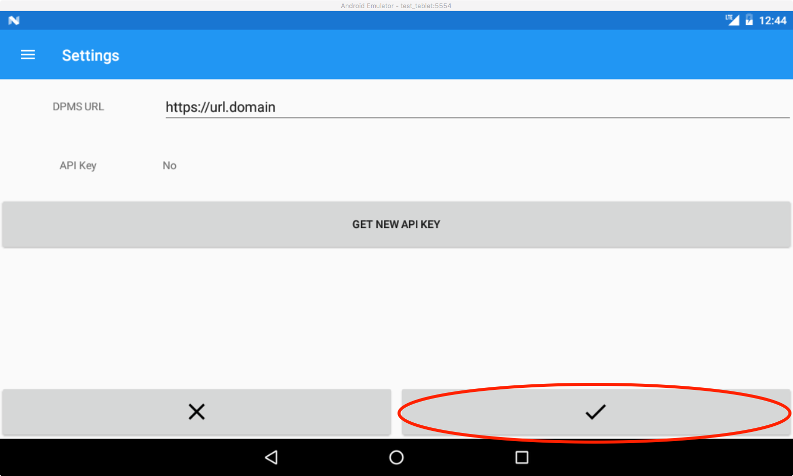
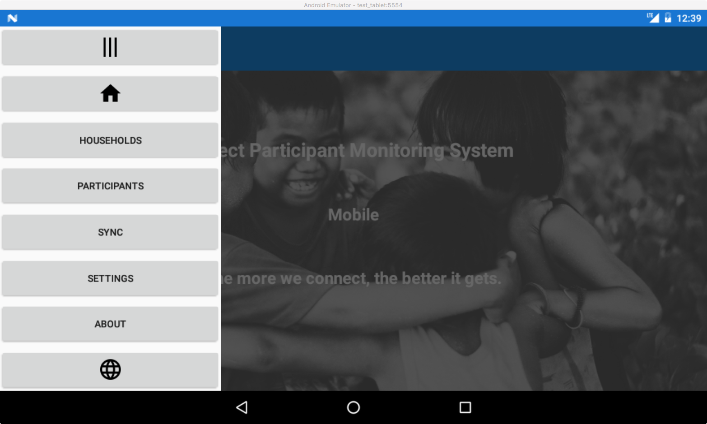

# Mobile Direct Participant Monitoring System User Guide

- U.S. Department of Labor
- Bureau of International Labor Affairs
- September 17, 2018
- IMPAQ International, LLC

- SUBMITTED TO
  - U.S. Department of Labor
  - Bureau of International Labor Affairs
- ATTENTION
  - U.S. Department of Labor
  - Bureau of International Labor Affairs, Room S-5317
  - 200 Constitution Ave. NW
  - Washington, DC 20210
  - United States
- SUBMITTED BY
  - IMPAQ International, LLC
  - 10420 Little Patuxent Parkway
  - Suite 300
  - Columbia, MD 21044
  - (443)256-5500
  - [www.impaqint.com](https://www.impaqint.com)
- CHILD LABOR DIRECT PARTICIPANT MONITORING SYSTEM
  - Mobile Direct Participant Monitoring System User Guide
  - Funding is provided by the United States Department of Labor under cooperative agreement number IL-26684-14-75-K-24.

*This material does not necessarily reflect the views or policies of the United States Department of Labor, nor does mention of trade names, commercial products, or organizations imply endorsement by the United States Government. 100% percent of the total costs of the project or program is financed with Federal funds, for a total of $1,246,847.00 dollars.*

## Table of Contents

- [1. Introduction](#1-introduction)
- [2. System Activation](#2-system-activation)
    - [2.1 Setup Considerations](#21-setup-considerations)
    - [2.2 User Access](#22-user-access)
    - [2.3 Installation and Set Up](#23-installation-and-set-up)
        - [2.3.1 mDPMS Installation](#231-mdpms-installation)
        - [2.3.2 Accessing the mDPMS](#232-accessing-the-mdpms)
        - [2.3.3 Initial Sync](#233-initial-sync)
    - [2.4 System Organization & Navigation](#24-system-organization--navigation)
- [3. Using the System](#3-using-the-system)
    - [3.1 Menu Item Overview](#31-menu-item-overview)
        - [3.1.1 Open/Close Menu](#311-openclose-menu)
        - [3.1.2 Home](#312-home)
        - [3.1.3 Households](#313-households)
        - [3.1.4 Participants](#314-participants)
        - [3.1.5 Sync](#315-sync)
        - [3.1.6 Settings](#316-settings)
        - [3.1.7 About](#317-about)
        - [3.1.8 Localization](#318-localization)
    - [3.2 Viewing and Collecting Data](#32-viewing-and-collecting-data)
        - [3.2.1 Households Search View](#321-households-search-view)
        - [3.2.2 Participants Search View](#322-participants-search-view)
        - [3.2.3 Household](#323-household-view)
        - [3.2.4 Income Source View](#324-income-source-view)
        - [3.2.5 Person View](#325-person-view)
        - [3.2.6 Follow Up View](#326-follow-up-view)
        - [3.2.7 Service Assignment](#327-service-assignment-view)
    - [3.3 Syncing](#33-syncing)
    - [3.4 Localization](#34-localization)

## Table of Exhibits

[Exhibit 1.  Overview of the Communication Between the mDPMS and DPMS](#exhibit-1-overview-of-the-communication-between-the-mdpms-and-dpms)

[Exhibit 2.  Opening the menu](#exhibit-2-opening-the-menu)

[Exhibit 3.  Select SETTINGS](#exhibit-3-select-settings)

[Exhibit 4.  Enter DPMS Web Address](#exhibit-4-enter-dpms-web-address)

[Exhibit 5.  Saving the Address](#exhibit-5-saving-the-address)

[Exhibit 6.  Get API Key](#exhibit-6-get-api-key)

[Exhibit 7.  Authenticate Screen](#exhibit-7-authenticate-screen)

[Exhibit 8.  Authenticate Button](#exhibit-8-authenticate-button)

[Exhibit 9.  Successfully Received API Key](#exhibit-9-successfully-received-api-key)

[Exhibit 10.  Select SYNC](#exhibit-10-select-sync)

[Exhibit 11.  Syncing Notification](#exhibit-11-syncing-notification)

[Exhibit 12.  Successful Sync Message](#exhibit-12-successful-sync-message)

[Exhibit 13:  mDPMS Menu](#exhibit-13-mdpms-menu)

[Exhibit 14.  Open/Close Menu](#exhibit-14-openclose-menu)

[Exhibit 15.  Home Menu Item](#exhibit-15-home-menu-item)

[Exhibit 16.  Households Menu Item](#exhibit-16-households-menu-item)

[Exhibit 17.  Participants Menu Item](#exhibit-17-participants-menu-item)

[Exhibit 18. Sync Menu Item](#exhibit-18-sync-menu-item)

[Exhibit 19.  Settings Menu Item](#exhibit-19-settings-menu-item)

[Exhibit 20.  About Menu Item](#exhibit-20-about-menu-item)

[Exhibit 21.  Localization Menu Item](#exhibit-21-localization-menu-item)

[Exhibit 22.  Households Search View](#exhibit-22-households-search-view)

[Exhibit 23.  Participants Search](#exhibit-23-participants-search)

[Exhibit 24.  Viewing Household Intake Details](#exhibit-24-viewing-household-intake-details)

[Exhibit 25.  Edit or Delete Household](#exhibit-25-edit-or-delete-household)

[Exhibit 26.  Add New Household](#exhibit-26-add-new-household)

[Exhibit 27.  Edit Household](#exhibit-27-edit-household)

[Exhibit 28.  List of Household’s Income Sources](#exhibit-28-list-of-households-income-sources)

[Exhibit 29.  Household Members List](#exhibit-29-household-members-list)

[Exhibit 30.  Viewing Income Source Details](#exhibit-30-viewing-income-source-details)

[Exhibit 31.  Edit or Delete Income Source](#exhibit-31-edit-or-delete-income-source)

[Exhibit 32.  Add New Income Source](#exhibit-32-add-new-income-source)

[Exhibit 33.  Edit Income Source](#exhibit-33-edit-income-source)

[Exhibit 34.  Viewing Household Member Details](#exhibit-34-viewing-household-member-details)

[Exhibit 35.  Viewing Household Member Follow Ups](#exhibit-35-viewing-household-member-follow-ups)

[Exhibit 36.  Viewing Household Member Service Assignments](#exhibit-36-viewing-household-member-service-assignments)

[Exhibit 37.  Edit or Delete Household Member](#exhibit-37-edit-or-delete-household-member)

[Exhibit 38.  Add New Household Member](#exhibit-38-add-new-household-member)

[Exhibit 39.  Edit Household Member](#exhibit-39-edit-household-member)

[Exhibit 40.  View Follow Up Details](#exhibit-40-view-follow-up-details)

[Exhibit 41.  Edit or Delete Follow Up](#exhibit-41-edit-or-delete-follow-up)

[Exhibit 42.  Add New Follow Up](#exhibit-42-add-new-follow-up)

[Exhibit 43.  Edit Follow Up](#exhibit-43-edit-follow-up)

[Exhibit 44.  View Service Assignment Details](#exhibit-44-view-service-assignment-details)

[Exhibit 45.  Edit or Delete Service Assignment](#exhibit-45-edit-or-delete-service-assignment)

[Exhibit 46.  Add New Service Assignment](#exhibit-46-add-new-service-assignment)

[Exhibit 47.  Edit Service Assignment](#exhibit-47-edit-service-assignment)

[Exhibit 48.  Select Localization Selection Menu Item](#exhibit-48-select-localization-selection-menu-item)

[Exhibit 49.  Localization Selection View](#exhibit-49-localization-selection-view)

[Exhibit 50.  Changing Localization Selection](#exhibit-50-changing-localization-selection)

## Table of Acronym

| Acronym | Literal Translation |
|---------|---------------------|
| DOL | U.S. Department of Labor |
| DPMS | Direct Participant Monitoring System |
| ILAB | Bureau of International Labor Affairs |
| mDPMS | Mobile Direct Participant Monitoring System |
| OCFT | Office of Child Labor, Forced Labor, and Human Trafficking |
| UG | User Guide |

## 1. Introduction

The U.S. Department of Labor’s (DOL) Bureau of International Labor Affairs (ILAB), Office of Child Labor, Forced Labor, and Human Trafficking (OCFT), funds international programs to eliminate the worst forms of child labor, forced labor, and human trafficking.[[1]](#footnotes) OCFT requires all OCFT-funded projects that provide education, training and livelihood services to develop and implement a system to monitor service provision and child and education status of participant children and households.

To gather the required OCFT participant data, USDOL/ILAB developed a Mobile Direct Participant Monitoring System (mDPMS). The mDPMS allows ILAB grantees (hereafter referred to as “users”) to collect data on a wide variety of Android mobile devices even in remote areas where there is no access to the internet. These data can be stored on the mobile device until the device can be connected to the internet and the data can be synchronized with the project’s Direct Participant Monitoring System (DPMS).[[2]](#footnotes) The DPMS is a web application that allows users to manage required OCFT participant data. [Exhibit 1](#exhibit-1-overview-of-the-communication-between-the-mdpms-and-dpms) illustrates a high-level overview of how the mDPMS and DPMS function together. Specifically, data can be collected in the field on multiple mobile systems in areas where there may be no access to the Internet. Once access to the Internet is established, users can download and synchronize the data with the DPMS Home.

### *Exhibit 1. Overview of the Communication Between the mDPMS and DPMS*


This document serves as the mDPMS User Guide and provides an overview on how to effectively use the mDPMS mobile application. It includes descriptions of the mDPMS system, its functions, capabilities, and step-by-step procedures for accessing and using the application.

## 2. System Activation

This section describes how to install and activate the mDPMS. It also includes instructions for setting up the system and adding mDPMS users. The section also provides a brief overview of the mDPMS organization and navigation.

### 2.1 SETUP CONSIDERATIONS

The mDPMS application is an Android mobile application and supports Android devices running 4.0.3 to 8.1.[[3]](#footnotes) The system will run on either a tablet or a smartphone; however, the tablet is the recommended device due to its larger navigational screen that will allow users to easily input participant data. Although it is not necessary to have internet access while using a device with mDPMS, users must have internet access for setup steps outlined in section 2.3 User Access. In addition, users need access to their project's DPMS to synchronize the collected data.

### 2.2 USER ACCESS

Users must have access to their project's DPMS to set up the mDPMS application. The DPMS must be created from the following link: [https://github.com/USDepartmentofLabor/Child-Labor-Participant-Monitoring-Toolkit](https://github.com/USDepartmentofLabor/Child-Labor-Participant-Monitoring-Toolkit).

### 2.3 INSTALLATION AND SET UP

To use the mDPMS, the application must be installed on the user’s mobile device. This section details the instructions for installing and setting up the mDPMS. Key topics include:

- mDPMS installation
- Obtaining an access key
- Performing the initial synchronization of project data.

#### 2.3.1 mDPMS Installation

Users must download and install the mDPMS from the Google Play Store. They can do this from their Android device using the following link: [https://play.google.com/store/apps/details?id=com.companyname.MDPMS](https://play.google.com/store/apps/details?id=com.companyname.MDPMS)

For further assistance in installing the application please see the following links:

- How to find the Google Play Store app:
  - [https://support.google.com/googleplay/answer/190860](https://support.google.com/googleplay/answer/190860)
- How to get Android apps:
  - [https://support.google.com/googleplay/answer/113409](https://support.google.com/googleplay/answer/113409)

#### 2.3.2 Accessing the mDPMS

Once the mDPMS is installed, the user must access the system using the access key provided by their project’s DPMS. The access key allows the mDPMS to communicate directly to the project’s DPMS. To obtain the mDPMS access key, the user must complete the following steps:

1. Launch the app on your device
2. Open the menu by selecting ```☰``` on the top left of the screen, illustrated in [Exhibit 2](#exhibit-2-opening-the-menu), if it’s not already open
##### *Exhibit 2. Opening the menu*

3. Select ```SETTINGS``` from the menu ([Exhibit 3](#exhibit-3-select-settings))
##### *Exhibit 3. Select SETTINGS*

4. Enter the DPMS web address in the text entry ```DPMS URL``` field ([Exhibit 4](#exhibit-4-enter-dpms-web-address))
##### *Exhibit 4. Enter DPMS Web Address*

5. Select the checkmark button to save the address ([Exhibit 5](#exhibit-5-saving-the-address))
##### *Exhibit 5. Saving the Address*

6. Next select ```GET NEW API KEY``` button ([Exhibit 6](#exhibit-6-get-api-key))
##### *Exhibit 6. Get API Key*


- Selecting the ```GET NEW API KEY``` button will open the Authenticate screen. Enter your DPMS credentials ([Exhibit 7](#exhibit-7-authenticate-screen))

##### *Exhibit 7. Authenticate Screen*


- Next select the ```AUTHENTICATE``` button ([Exhibit 8](#exhibit-8-authenticate-button))

##### *Exhibit 8. Authenticate Button*


- If the access key authentication was successful, the user will be sent back to the Settings screen and the API Key will read Yes ([Exhibit 9](#exhibit-9-successfully-received-api-key)).

##### *Exhibit 9. Successfully Received API Key*


If the user receives an error message, they should check the following and re-do the access key steps outlined above:

- Ensure the internet access is operational
- Use a web browser from the device to access the DPMS
  - Can you can reach your DPMS from the device?
  - Is your DPMS online and working properly? If not please contact your administrator for assistance.
  - Are your credentials able to access your DPMS using the web browser?
- Ensure login credentials were entered correctly.
  - You can select ```Show Password``` on the Authenticate screen to view and verify the password entered.
  - Note that some Android devices will have autocorrect features enabled by default so check that the username is correct as well.

#### 2.3.3 Initial Sync

Once you have obtained your access key, you will need to perform an initial synchronization of the project’s data. This initial sync will download all project data to allow the user to begin collecting their project’s required OCFT data. This synced data includes custom fields, status customizations, and services. For example, the services defined in the DPMS will sync to allow the user to collect service data. To start the initial sync of the project’s data, select ```SYNC``` from the menu as shown in [Exhibit 10](#exhibit-10-select-sync).

##### *Exhibit 10. Select SYNC*


When the user selects the ```SYNC``` menu option, as illustrated in [Exhibit 11](#exhibit-11-syncing-notification), the application will keep the user notified as the sync is performed. If you receive an error message, please check the following:

- Ensure the internet access is operational
- Use a web browser from the device to access the DPMS
  - Can you can reach your DPMS from the device?
  - Is your DPMS online and working properly? If not please contact your administrator for assistance.
  - Are your credentials able to access your DPMS using the web browser?
- Ensure login credentials were entered correctly.
  - You can select ```Show Password``` on the Authenticate screen to view and verify the password entered.
  - Note that some Android devices will have autocorrect features enabled by default so check that the username is correct as well.

##### *Exhibit 11. Syncing Notification*


Once the sync is complete, the user will see a message that the sync was successful as illustrated in [Exhibit 12](#exhibit-12-successful-sync-message). The user can now begin using the mDPMS to collect participant data offline.

##### *Exhibit 12. Successful Sync Message*


## 2.4 SYSTEM ORGANIZATION & NAVIGATION

The data in the following hierarchy can be viewed and collected using mDPMS:

- Households
    - Income Sources
    - Household Members (Program Participants and other Household Members)
      - Intakes
      - Follow Ups
      - Service Assignments

There are two main entry points on the menu for accessing data. Each entry point provides access down the hierarchy.

- HOUSEHOLDS view
  - This will allow access to any Household and related data in the DPMS at the time of last sync and locally entered
- PARTICIPANTS view
  - This will allow access to any Program Participant in the DPMS at the time of last sync and locally entered

Program Participant is defined as a person between the ages of 5 and 17 at the date of viewing or at the date of intakeAll data can be edited or deleted on mDPMS if it has NOT been uploaded and synced to the project’s DPMS. If the data has been uploaded and synced to the project’s DPMS, it cannot be edited or deleted. To know if a data item has been synced to the DPMS, a unique ID number will be provided. Items without an ID number will have an edit and delete button present and can be modified until the data are synced.

When data is deleted, all data gathered under in that hierarchy will also be deleted. For instance, if you delete a household, all household members under that household will also be deleted. If you delete an individual, all service and follow-up information will be erased.

## 3. Using the System

This section provides details on using the mDPMS including how to use the application’s menu and options, viewing and collecting data, and syncing and localization.

### 3.1 MENU ITEM OVERVIEW

This section describes each item in the the mDPMS menu. The mDPMS menu is shown in [Exhibit 13](#exhibit-13-mdpms-menu).

#### *Exhibit 13: mDPMS Menu*



#### 3.1.1 Open/Close Menu

To open or close the menu, the user must select the ```☰``` button (illustrated In [Exhibit 14](#exhibit-14-openclose-menu)).

##### *Exhibit 14. Open/Close Menu*


#### 3.1.2 Home

To navigate to the Landing View, select the Home menu item ([Exhibit 15](#exhibit-15-home-menu-item)).

##### *Exhibit 15. Home Menu Item*


#### 3.1.3 Households

Selecting the ```HOUSEHOLDS``` menu item ([Exhibit 16](#exhibit-16-households-menu-item)) will navigate the user to the Households Search View. The Households Search View allows users to search Households, add a new Household, and view all data. More information about the Households Search View can be found in section [3.2.1](#321-households-search-view).

##### *Exhibit 16. Households Menu Item*


#### 3.1.4 Participants

Selecting the ```PARTICIPANTS``` menu item navigates the user to the Participants Search View. The Participants Search View allows users to search all Program Participants and view Program Participants and related data. More information about the Participants Search View can be found in section [3.2.2](#322-participants-search-view).

##### *Exhibit 17. Participants Menu Item*


#### 3.1.5 Sync

Selecting the ```SYNC``` menu item ([Exhibit 18](#exhibit-18-sync-menu-item)) initiates a sync action which will sync the data on the mobile device with the project DPMS. More information about syncing can be found in section [3.3](#33-syncing).

##### *Exhibit 18. Sync Menu Item*


#### 3.1.6 Settings

Selecting the ```SETTINGS``` menu item ([Exhibit 19](#exhibit-19-settings-menu-item)) navigates to the Settings View where users can change the DPMS URL or credentials. More information about the settings can be found in section [2.3.2](#232-accessing-the-mdpms) describing set up.

##### *Exhibit 19. Settings Menu Item*


#### 3.1.7 About

Selecting the ```ABOUT``` menu item ([Exhibit 20](#exhibit-20-about-menu-item)) navigates to the About View displaying application version information.

##### *Exhibit 20. About Menu Item*


#### 3.1.8 Localization

Selecting the Localization menu item ([Exhibit 21](#exhibit-21-localization-menu-item)) navigates to the Localization Selection View. The Localization Section View allows users to change the localization of the application. More information about the changing localization can be found in section [3.4](#34-localization).

##### *Exhibit 21. Localization Menu Item*


### 3.2 VIEWING AND COLLECTING DATA

This section describes how to view and collect data using the mDPMS.

- Households Search View
- Participants Search View
- Household View
- Income Source View
- Person View
- Follow Up View
- Service Assignment View

#### 3.2.1 Households Search View

The Households Search is displayed when the user selects the ```HOUSEHOLDS``` menu item. It allows users to perform the following actions listed below. [Exhibit 22](#exhibit-22-households-search-view) displays the Households Search view.

- View and search all Households in the mDPMS. This will include Households from the project DPMS at the time of last sync and any Households entered locally into the mDPMS.
- Select a Household to navigate to the Household view
- View the number of Households in the mDPMS
- Add a Household

##### *Exhibit 22. Households Search View*


#### 3.2.2 Participants Search View

Selecting the ```PARTICIPANTS``` menu item will display the Participants Search which is shown in [Exhibit 23](#exhibit-23-participants-search). The Participants Search allows users to perform the following actions.

- View and search all Program Participants in the DPMS at the time of last sync and locally entered
- Select a Program Participant to navigate to the Person view
- View the number of Program Participants

##### *Exhibit 23. Participants Search*


#### 3.2.3 Household View

Selecting a Household in the Households Search will cause the Household to be displayed in the Household view. The Household view allows users to perform the following actions:

- View the properties for a Household at intake ([Exhibit 24](#exhibit-24-viewing-household-intake-details))
- Add a new Household if ```ADD NEW HOUSEHOLD``` was selected from the Households Search view ([Exhibit 26](#exhibit-26-add-new-household))
- Edit or delete the Household if not synced (Exhibits [25](#exhibit-25-edit-or-delete-household) and [27](#exhibit-27-edit-household))
- View a list of the Income Sources for a Household ([Exhibit 28](#exhibit-28-list-of-households-income-sources))
  - Select an Income Source to navigate to the Income Source view
  - Add an Income Source
- View a list of the Program Participants or other Members of a Household ([Exhibit 29](#exhibit-29-household-members-list))
  - Select a Person to navigate to the Person view
  - Add a Person

##### *Exhibit 24. Viewing Household Intake Details*


##### *Exhibit 25. Edit or Delete Household*


##### *Exhibit 26. Add New Household*


##### *Exhibit 27. Edit Household*


##### *Exhibit 28. List of Household’s Income Sources*


##### *Exhibit 29. Household Members List*


#### 3.2.4 Income Source View

Selecting an Income Source in the Household view will cause the Income Source to be displayed in the Income Source View. The Income Source View allows users to perform the following actions.

- View the properties for an Income Source ([Exhibit 30](#exhibit-30-viewing-income-source-details))
- Add a new Income Source if ```ADD INCOME SOURCE``` was selected from the Household Income Source list ([Exhibit 32](#exhibit-32-add-new-income-source))
- Edit or delete the Income Source if not synced (Exhibits [31](#exhibit-31-edit-or-delete-income-source) and [33](#exhibit-33-edit-income-source))

##### *Exhibit 30. Viewing Income Source Details*


##### *Exhibit 31. Edit or Delete Income Source*


##### *Exhibit 32. Add New Income Source*


##### *Exhibit 33. Edit Income Source*


#### 3.2.5 Person View

Selecting a Program Participant or other Household Member in the Household Members list of the Household view or Participants view will cause the Program Participant or other Household Member to be displayed in the Person view. The Person view allows users to perform the following actions:

- View the properties for a Program Participant or other Household Member ([Exhibit 34](#exhibit-34-viewing-household-member-details))
- View a list of the Follow Ups for a Program Participant or other Household Member ([Exhibit 35](#exhibit-35-viewing-household-member-follow-ups))
  - Select a Follow Up to navigate to the Follow Up view
- View a list of the Service Assignments for a Program Participant or other Household Member ([Exhibit 36](#exhibit-36-viewing-household-member-service-assignments))
  - Select a Service Assignment to navigate to the Service Assignment view
- Add a Program Participant or other Household Member if ```ADD HOUSEHOLD MEMBER``` was selected from the Household Member list of the Household view ([Exhibit 38](#exhibit-38-add-new-household-member))
- Edit or delete a Program Participant or other Household Member if not synced (Exhibits [37](#exhibit-37-edit-or-delete-household-member) and [39](#exhibit-39-edit-household-member))

##### *Exhibit 34. Viewing Household Member Details*


##### *Exhibit 35. Viewing Household Member Follow Ups*


##### *Exhibit 36. Viewing Household Member Service Assignments*


##### *Exhibit 37. Edit or Delete Household Member*


##### *Exhibit 38. Add New Household Member*


##### *Exhibit 39. Edit Household Member*


#### 3.2.6 Follow Up View

Selecting a Follow Up in the Person view will cause the Follow Up to be displayed in the Follow Up view. The Follow Up view allows users to perform the following actions.

- View the properties for a Follow Up ([Exhibit 40](#exhibit-40-view-follow-up-details))
- Add a new Follow Up if ```ADD FOLLOW UP``` was selected from the Person Follow Up list ([Exhibit 42](#exhibit-42-add-new-follow-up))
- Edit or delete the Follow Up if not synced (Exhibits [41](#exhibit-41-edit-or-delete-follow-up) and [43](#exhibit-43-edit-follow-up))

##### *Exhibit 40. View Follow Up Details*


##### *Exhibit 41. Edit or Delete Follow Up*


##### *Exhibit 42. Add New Follow Up*


##### *Exhibit 43. Edit Follow Up*


#### 3.2.7 Service Assignment View

Selecting a Service Assignment in the Person View will cause the Service Assignment to be displayed in the Service Assignment view. The Service Assignment view allows users to perform the following actions:

- View the properties for a Service Assignment ([Exhibit 44](#exhibit-44-view-service-assignment-details))
- Add a new Service Assignment if ```ASSIGN SERVICE``` was selected from the Person Service Assignment list ([Exhibit 46](#exhibit-46-add-new-service-assignment))
- Edit or delete the Service Assignment if not synced (exhibits [45](#exhibit-45-edit-or-delete-service-assignment) and [47](#exhibit-47-edit-service-assignment))

##### *Exhibit 44. View Service Assignment Details*


##### *Exhibit 45. Edit or Delete Service Assignment*


##### *Exhibit 46. Add New Service Assignment*


##### *Exhibit 47. Edit Service Assignment*


### 3.3 SYNCING

Data that is collected offline can be synced when an internet connection is available. Use the ```SYNC``` button from the menu to sync when desired. Syncing operates by sending new locally created data to the DPMS and getting new data and changes from the DPMS. It is based on the timestamp of each record which is updated every time it changes. The more data in a DPMS the longer the sync will take to complete. The better the capabilities of the device being used, the less time it will take to sync. Storage space even with a larger DPMS will typically be under even the smallest SD card sizes generally available (100 - 200 MB).

### 3.4 LOCALIZATION

The mDPMS application is also available in the following languages:

- English
- Español
- Français
- Português

To change the localization at any time, the user should:

- Select the globe icon from the menu

#### *Exhibit 48. Select Localization Selection Menu Item*


#### *Exhibit 49. Localization Selection View*


- Select your localization
- Select the check to confirm

#### *Exhibit 50. Changing Localization Selection*


## Footnotes

1. Authorized by the Consolidated Appropriations Act, Public Law 113-76 (2014).
2. Projects that focus on research or capacity building are not required to implement a DPMS, but they may elect to use the ILAB’s DPMS to submit their TPR
3. The mDPMS application supports Android devices running 4.0.3 up to the current release at the time of this documentation (8.1 as of June 2018).
